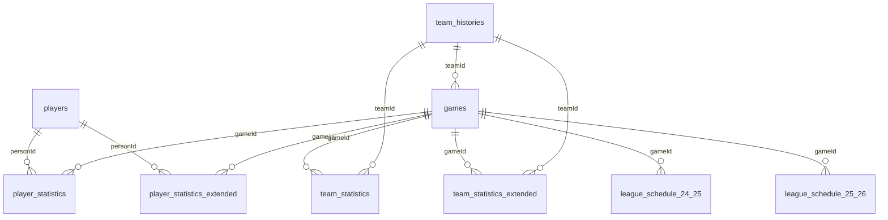

# Diccionario de datos NBA

Este documento describe las tablas disponibles en la base de datos `nba_mbd`, incluyendo las tablas originales y las tablas adicionales incorporadas para el curso.

## Relaciones entre las tablas

### Esquema de relaciones

- **`players.personId`** → **`player_statistics.personId`**
- **`players.personId`** → **`player_statistics_extended.personId`**
- **`games.gameId`** → **`team_statistics.gameId`**
- **`games.gameId`** → **`team_statistics_extended.gameId`**
- **`games.gameId`** → **`player_statistics.gameId`**
- **`games.gameId`** → **`player_statistics_extended.gameId`**
- **`team_histories.teamId`** → **`games.hometeamId`**
- **`team_histories.teamId`** → **`games.awayteamId`**
- **`team_histories.teamId`** → **`team_statistics.teamId`**
- **`team_histories.teamId`** → **`team_statistics_extended.teamId`**
- **`league_schedule_24_25`** y **`league_schedule_25_26`** contienen información de calendario y pueden relacionarse con `games` mediante `gameId`.

> **Importante:** `team_statistics` y `team_statistics_extended` tienen normalmente dos registros por partido, uno por cada equipo. Al relacionarlas con estadísticas de jugadores es recomendable utilizar `gameId` **y** `teamId/playerteamId`, no únicamente `gameId`.

### Diagrama relacional simplificado

---

# Tablas principales

## Tabla: `players` (Jugadores)

| Campo | Tipo | Traducción | Explicación |
|---|---|---|---|
| `personId` | INT | ID Jugador | Identificador único del jugador |
| `firstName` | TEXT | Nombre | Nombre del jugador |
| `lastName` | TEXT | Apellido | Apellido del jugador |
| `birthDate` | DATE | Fecha de nacimiento | Fecha de nacimiento |
| `school` | TEXT | Universidad/Institución | Universidad o institución del jugador |
| `country` | TEXT | País | País asociado al jugador |
| `heightInches` | FLOAT | Altura | Altura en pulgadas |
| `bodyWeightLbs` | FLOAT | Peso | Peso en libras |
| `jersey` | TEXT | Dorsal | Número de camiseta |
| `guard` | INT | Base/Escolta | Indicador de que el jugador puede jugar de guard |
| `forward` | INT | Alero/Ala-pívot | Indicador de que puede jugar de forward |
| `center` | INT | Pívot | Indicador de que puede jugar de center |
| `dleagueFlag` | INT | D-League | Indicador relacionado con D-League/G League |
| `nbaFlag` | INT | NBA | Indicador relacionado con NBA |
| `gamesPlayedFlag` | INT | Partidos jugados | Indicador relacionado con partidos jugados |
| `draftYear` | FLOAT | Año Draft | Año en que fue seleccionado |
| `draftRound` | FLOAT | Ronda Draft | Ronda en la que fue seleccionado |
| `draftNumber` | FLOAT | Número Draft | Puesto global en el draft |
| `fromYear` | INT | Desde | Primer año registrado |
| `toYear` | INT | Hasta | Último año registrado |

---

## Tabla: `team_histories` (Historial de equipos)

| Campo | Tipo | Traducción | Explicación |
|---|---|---|---|
| `teamId` | INT | ID Equipo | Identificador del equipo |
| `teamCity` | TEXT | Ciudad | Ciudad del equipo |
| `teamName` | TEXT | Nombre equipo | Nombre del equipo |
| `teamAbbrev` | TEXT | Abreviatura | Abreviatura del equipo |
| `seasonFounded` | FLOAT | Fundación | Año en que fue fundado |
| `seasonActiveTill` | FLOAT | Último año activo | Última temporada registrada para esa franquicia |
| `league` | TEXT | Liga | Liga a la que perteneció |

> No se ha definido una PK estricta en esta tabla porque el dataset puede contener duplicados.

---

# Partidos y estadísticas

## Tabla: `games` (Partidos)

| Campo | Tipo | Traducción | Explicación |
|---|---|---|---|
| `gameId` | TEXT | ID Partido | Identificador único del partido |
| `gameDateTimeEst` | TIMESTAMP | Fecha/hora | Fecha y hora del partido |
| `hometeamCity` | TEXT | Ciudad local | Ciudad del equipo local |
| `hometeamName` | TEXT | Equipo local | Nombre del equipo local |
| `hometeamId` | INT | ID local | ID del equipo local |
| `awayteamCity` | TEXT | Ciudad visitante | Ciudad del equipo visitante |
| `awayteamName` | TEXT | Equipo visitante | Nombre del equipo visitante |
| `awayteamId` | INT | ID visitante | ID del equipo visitante |
| `homeScore` | INT | Puntos local | Puntos anotados por el equipo local |
| `awayScore` | INT | Puntos visitante | Puntos anotados por el equipo visitante |
| `winner` | INT | Ganador | ID del equipo ganador |
| `gameType` | TEXT | Tipo | Tipo de partido, por ejemplo Regular Season o Playoffs |
| `gameSubtype` | TEXT | Subtipo | Subtipo del partido |
| `gameLabel` | TEXT | Etiqueta | Descripción del partido |
| `gameSubLabel` | TEXT | Sub-etiqueta | Información adicional |
| `seriesGameNumber` | TEXT | Nº partido serie | Número del partido dentro de una serie |
| `attendance` | INT | Asistencia | Número de espectadores |
| `arenaId` | TEXT | ID pabellón | Identificador del pabellón |
| `arenaName` | TEXT | Pabellón | Nombre del pabellón |
| `arenaCity` | TEXT | Ciudad pabellón | Ciudad del pabellón |
| `arenaState` | TEXT | Estado | Estado de EE. UU. |
| `officials` | TEXT | Árbitros | Árbitros del partido |
| `gameDate` | TIMESTAMP | Fecha partido | Fecha y hora del partido |

---

## Tabla: `team_statistics` (Estadísticas básicas de equipos)

Contiene un registro por equipo y partido.

| Campo | Tipo | Traducción | Explicación |
|---|---|---|---|
| `gameId` | TEXT | ID Partido | Identificador del partido |
| `gameDateTimeEst` | TIMESTAMP | Fecha/hora | Fecha y hora |
| `teamCity` | TEXT | Ciudad equipo | Ciudad del equipo |
| `teamName` | TEXT | Equipo | Nombre del equipo |
| `teamId` | INT | ID Equipo | Identificador |
| `opponentTeamCity` | TEXT | Ciudad rival | Ciudad del rival |
| `opponentTeamName` | TEXT | Rival | Nombre del rival |
| `opponentTeamId` | INT | ID rival | Identificador del rival |
| `home` | BOOLEAN | ¿Local? | Si el equipo jugó como local |
| `win` | BOOLEAN | ¿Victoria? | Si ganó el partido |
| `teamScore` | FLOAT | Puntos | Puntos anotados |
| `opponentScore` | FLOAT | Puntos rival | Puntos recibidos |
| `assists` | FLOAT | Asistencias | Asistencias del equipo |
| `blocks` | FLOAT | Tapones | Tapones realizados |
| `steals` | FLOAT | Robos | Robos realizados |
| `fieldGoalsAttempted` | FLOAT | Tiros de campo intentados | Intentos |
| `fieldGoalsMade` | FLOAT | Tiros de campo anotados | Canastas convertidas |
| `fieldGoalsPercentage` | FLOAT | % tiros de campo | Porcentaje de acierto |
| `threePointersAttempted` | FLOAT | Triples intentados | Intentos de triple |
| `threePointersMade` | FLOAT | Triples anotados | Triples convertidos |
| `threePointersPercentage` | FLOAT | % triples | Porcentaje de acierto |
| `freeThrowsAttempted` | FLOAT | TL intentados | Tiros libres intentados |
| `freeThrowsMade` | FLOAT | TL anotados | Tiros libres convertidos |
| `freeThrowsPercentage` | FLOAT | % TL | Porcentaje de acierto |
| `reboundsDefensive` | FLOAT | Rebotes defensivos | Rebotes defensivos |
| `reboundsOffensive` | FLOAT | Rebotes ofensivos | Rebotes ofensivos |
| `reboundsTotal` | FLOAT | Rebotes totales | Total de rebotes |
| `foulsPersonal` | FLOAT | Faltas | Faltas personales |
| `turnovers` | FLOAT | Pérdidas | Balones perdidos |
| `plusMinusPoints` | FLOAT | +/- | Diferencia de puntos |
| `numMinutes` | FLOAT | Minutos | Minutos jugados por el equipo |
| `q1Points` | FLOAT | Puntos Q1 | Puntos del primer cuarto |
| `q2Points` | FLOAT | Puntos Q2 | Puntos del segundo cuarto |
| `q3Points` | FLOAT | Puntos Q3 | Puntos del tercer cuarto |
| `q4Points` | FLOAT | Puntos Q4 | Puntos del cuarto cuarto |
| `benchPoints` | FLOAT | Puntos banquillo | Puntos de los suplentes |
| `biggestLead` | FLOAT | Mayor ventaja | Máxima ventaja |
| `biggestScoringRun` | FLOAT | Racha máxima | Mayor racha de anotación |
| `leadChanges` | FLOAT | Cambios de liderato | Veces que cambió el líder |
| `pointsFastBreak` | FLOAT | Contraataque | Puntos en transición |
| `pointsFromTurnovers` | FLOAT | Puntos por pérdidas | Puntos tras pérdidas rivales |
| `pointsInThePaint` | FLOAT | Puntos en pintura | Puntos en la zona |
| `pointsSecondChance` | FLOAT | Segunda oportunidad | Puntos tras rebote ofensivo |
| `timesTied` | FLOAT | Empates | Veces que se empató |
| `timeoutsRemaining` | FLOAT | Tiempos muertos | Tiempos muertos restantes |
| `seasonWins` | FLOAT | Victorias temporada | Victorias acumuladas |
| `seasonLosses` | FLOAT | Derrotas temporada | Derrotas acumuladas |
| `coachId` | INT | ID Entrenador | Identificador del entrenador |
| `gameType` | TEXT | Tipo | Tipo de partido |
| `gameLabel` | TEXT | Etiqueta | Etiqueta del partido |
| `gameSubLabel` | TEXT | Sub-etiqueta | Sub-etiqueta |
| `seriesGameNumber` | TEXT | Nº partido serie | Número dentro de la serie |
| `seed` | INT | Seed | Cabeza de serie |
| `reboundsTeam` | FLOAT | Rebotes equipo | Rebotes de equipo |
| `turnoversTeam` | FLOAT | Pérdidas equipo | Pérdidas atribuidas al equipo |
| `ot1Points` | FLOAT | Puntos OT1 | Puntos en primera prórroga |
| `ot2Points` | FLOAT | Puntos OT2 | Puntos en segunda prórroga |
| `otAllPoints` | FLOAT | Puntos prórrogas | Puntos de las prórrogas |
| `gameDate` | TIMESTAMP | Fecha | Fecha y hora |

---

## Tabla: `player_statistics` (Estadísticas básicas de jugadores)

Contiene las estadísticas de cada jugador en cada partido.

| Campo | Tipo | Traducción | Explicación |
|---|---|---|---|
| `firstName` | TEXT | Nombre | Nombre del jugador |
| `lastName` | TEXT | Apellido | Apellido del jugador |
| `personId` | INT | ID Jugador | Identificador del jugador |
| `gameId` | TEXT | ID Partido | Identificador del partido |
| `gameDateTimeEst` | TIMESTAMP | Fecha/hora | Fecha y hora |
| `gameType` | TEXT | Tipo | Tipo de partido |
| `gameLabel` | TEXT | Etiqueta | Etiqueta |
| `gameSubLabel` | TEXT | Sub-etiqueta | Sub-etiqueta |
| `seriesGameNumber` | TEXT | Nº partido serie | Número dentro de la serie |
| `win` | BOOLEAN | ¿Victoria? | Si ganó su equipo |
| `home` | BOOLEAN | ¿Local? | Si jugó como local |
| `playerteamId` | INT | ID equipo | Equipo del jugador |
| `playerteamCity` | TEXT | Ciudad equipo | Ciudad de su equipo |
| `playerteamName` | TEXT | Equipo | Nombre de su equipo |
| `opponentteamId` | INT | ID rival | ID del rival |
| `opponentteamCity` | TEXT | Ciudad rival | Ciudad del rival |
| `opponentteamName` | TEXT | Rival | Nombre del rival |
| `comment` | TEXT | Comentario | Comentario asociado al jugador |
| `startingPosition` | TEXT | Posición inicial | Posición en el quinteto inicial |
| `numMinutes` | FLOAT | Minutos | Minutos jugados |
| `points` | FLOAT | Puntos | Puntos anotados |
| `assists` | FLOAT | Asistencias | Asistencias |
| `reboundsTotal` | FLOAT | Rebotes | Rebotes totales |
| `reboundsOffensive` | FLOAT | Rebotes ofensivos | Rebotes ofensivos |
| `reboundsDefensive` | FLOAT | Rebotes defensivos | Rebotes defensivos |
| `fieldGoalsMade` | FLOAT | Tiros anotados | Canastas convertidas |
| `fieldGoalsAttempted` | FLOAT | Tiros intentados | Intentos |
| `fieldGoalsPercentage` | FLOAT | % tiros | Porcentaje de acierto |
| `threePointersMade` | FLOAT | Triples anotados | Triples convertidos |
| `threePointersAttempted` | FLOAT | Triples intentados | Intentos |
| `threePointersPercentage` | FLOAT | % triples | Porcentaje de acierto |
| `freeThrowsMade` | FLOAT | TL anotados | Tiros libres convertidos |
| `freeThrowsAttempted` | FLOAT | TL intentados | Tiros libres |
| `freeThrowsPercentage` | FLOAT | % TL | Porcentaje de acierto |
| `steals` | FLOAT | Robos | Robos |
| `blocks` | FLOAT | Tapones | Tapones |
| `turnovers` | FLOAT | Pérdidas | Pérdidas de balón |
| `foulsPersonal` | FLOAT | Faltas | Faltas personales |
| `plusMinusPoints` | FLOAT | +/- | Diferencia de puntos |
| `gameDate` | TIMESTAMP | Fecha | Fecha y hora |

---

# Tablas estadísticas extendidas

## Tabla: `player_statistics_extended`

Es la versión ampliada de `player_statistics`. Mantiene las estadísticas básicas y añade métricas avanzadas.

### Identificación y contexto

| Campo | Tipo | Explicación |
|---|---|---|
| `firstName` | TEXT | Nombre |
| `lastName` | TEXT | Apellido |
| `personId` | INT | ID del jugador |
| `gameId` | TEXT | ID del partido |
| `gameDateTimeEst` | TIMESTAMP | Fecha/hora |
| `gameType` | TEXT | Tipo de partido |
| `gameLabel` | TEXT | Etiqueta |
| `gameSubLabel` | TEXT | Sub-etiqueta |
| `seriesGameNumber` | TEXT | Número de partido de la serie |
| `win` | BOOLEAN | Si ganó |
| `home` | BOOLEAN | Si jugó como local |
| `playerteamId` | INT | ID de su equipo |
| `playerteamCity` | TEXT | Ciudad de su equipo |
| `playerteamName` | TEXT | Nombre de su equipo |
| `opponentteamId` | INT | ID del rival |
| `opponentteamCity` | TEXT | Ciudad del rival |
| `opponentteamName` | TEXT | Nombre del rival |
| `comment` | TEXT | Comentario |
| `startingPosition` | TEXT | Posición inicial |

### Estadísticas básicas

| Campo | Tipo | Explicación |
|---|---|---|
| `numMinutes` | FLOAT | Minutos jugados |
| `points` | FLOAT | Puntos |
| `assists` | FLOAT | Asistencias |
| `reboundsTotal` | FLOAT | Rebotes totales |
| `reboundsOffensive` | FLOAT | Rebotes ofensivos |
| `reboundsDefensive` | FLOAT | Rebotes defensivos |
| `fieldGoalsMade` | FLOAT | Tiros de campo anotados |
| `fieldGoalsAttempted` | FLOAT | Tiros de campo intentados |
| `fieldGoalsPercentage` | FLOAT | % tiros de campo |
| `threePointersMade` | FLOAT | Triples anotados |
| `threePointersAttempted` | FLOAT | Triples intentados |
| `threePointersPercentage` | FLOAT | % triples |
| `freeThrowsMade` | FLOAT | TL anotados |
| `freeThrowsAttempted` | FLOAT | TL intentados |
| `freeThrowsPercentage` | FLOAT | % TL |
| `steals` | FLOAT | Robos |
| `blocks` | FLOAT | Tapones |
| `blocksAgainst` | FLOAT | Tapones recibidos |
| `turnovers` | FLOAT | Pérdidas |
| `foulsPersonal` | FLOAT | Faltas personales |
| `foulsAgainst` | FLOAT | Faltas recibidas |
| `plusMinusPoints` | FLOAT | +/- |

### Dobles-dobles, triples-dobles y métricas avanzadas

| Campo | Tipo | Explicación |
|---|---|---|
| `doubleDouble` | INT | Indicador de doble-doble |
| `tripleDouble` | INT | Indicador de triple-doble |
| `estimatedOffensiveRating` | FLOAT | Rating ofensivo estimado |
| `offensiveRating` | FLOAT | Rating ofensivo |
| `spWorkOffensiveRating` | FLOAT | Rating ofensivo SP Work |
| `estimatedDefensiveRating` | FLOAT | Rating defensivo estimado |
| `defensiveRating` | FLOAT | Rating defensivo |
| `spWorkDefensiveRating` | FLOAT | Rating defensivo SP Work |
| `estimatedNetRating` | FLOAT | Net rating estimado |
| `netRating` | FLOAT | Net rating |
| `spWorkNetRating` | FLOAT | Net rating SP Work |
| `assistPercentage` | FLOAT | Porcentaje de asistencias |
| `assistToTurnoverRatio` | FLOAT | Relación asistencias/pérdidas |
| `assistRatio` | FLOAT | Ratio de asistencias |
| `offensiveReboundPercentage` | FLOAT | % rebote ofensivo |
| `defensiveReboundPercentage` | FLOAT | % rebote defensivo |
| `reboundPercentage` | FLOAT | % rebotes |
| `teamTurnoverPercentage` | FLOAT | % pérdidas del equipo |
| `estimatedTurnoverPercentage` | FLOAT | % pérdidas estimado |
| `effectiveFieldGoalPercentage` | FLOAT | % tiro efectivo |
| `trueShootingPercentage` | FLOAT | % true shooting |
| `usagePercentage` | FLOAT | % de uso |
| `estimatedUsagePercentage` | FLOAT | % uso estimado |
| `estimatedPace` | FLOAT | Ritmo estimado |
| `pace` | FLOAT | Ritmo |
| `pacePer40` | FLOAT | Ritmo por 40 minutos |
| `spWorkPace` | FLOAT | Ritmo SP Work |
| `playerImpactEstimate` | FLOAT | Impacto estimado del jugador |
| `possessions` | FLOAT | Posesiones |

### Puntos y distribución del juego

| Campo | Tipo | Explicación |
|---|---|---|
| `pointsOffTurnovers` | FLOAT | Puntos tras pérdidas |
| `pointsSecondChance` | FLOAT | Puntos de segunda oportunidad |
| `pointsFastBreak` | FLOAT | Puntos de contraataque |
| `pointsInPaint` | FLOAT | Puntos en la pintura |
| `opponentPointsOffTurnovers` | FLOAT | Puntos del rival tras pérdidas |
| `opponentPointsSecondChance` | FLOAT | Puntos del rival de segunda oportunidad |
| `opponentPointsFastBreak` | FLOAT | Puntos del rival en contraataque |
| `opponentPointsInPaint` | FLOAT | Puntos del rival en pintura |

### Porcentajes de tiro y anotación

| Campo | Tipo | Explicación |
|---|---|---|
| `percentFieldGoalAttempts2Point` | FLOAT | % intentos de 2 |
| `percentFieldGoalAttempts3Point` | FLOAT | % intentos de 3 |
| `percentPoints2Point` | FLOAT | % puntos de 2 |
| `percentPoints2PointMidRange` | FLOAT | % puntos de media distancia |
| `percentPoints3Point` | FLOAT | % puntos de 3 |
| `percentPointsFastBreak` | FLOAT | % puntos de contraataque |
| `percentPointsFreeThrow` | FLOAT | % puntos de TL |
| `percentPointsOffTurnovers` | FLOAT | % puntos tras pérdidas |
| `percentPointsInPaint` | FLOAT | % puntos en pintura |

### Asistencias y distribución de tiros

| Campo | Tipo | Explicación |
|---|---|---|
| `percentAssisted2PointMade` | FLOAT | % de tiros de 2 asistidos |
| `percentUnassisted2PointMade` | FLOAT | % de tiros de 2 no asistidos |
| `percentAssisted3PointMade` | FLOAT | % de triples asistidos |
| `percentUnassisted3PointMade` | FLOAT | % de triples no asistidos |
| `percentAssistedFieldGoalsMade` | FLOAT | % de tiros de campo asistidos |
| `percentUnassistedFieldGoalsMade` | FLOAT | % de tiros de campo no asistidos |

### Participación respecto al equipo

| Campo | Tipo | Explicación |
|---|---|---|
| `percentTeamFieldGoalsMade` | FLOAT | % de canastas del equipo |
| `percentTeamFieldGoalsAttempted` | FLOAT | % de intentos del equipo |
| `percentTeamThreePointersMade` | FLOAT | % de triples del equipo |
| `percentTeamThreePointersAttempted` | FLOAT | % de intentos de triple del equipo |
| `percentTeamFreeThrowsMade` | FLOAT | % de TL del equipo |
| `percentTeamFreeThrowsAttempted` | FLOAT | % de intentos de TL del equipo |
| `percentTeamOffensiveRebounds` | FLOAT | % rebotes ofensivos del equipo |
| `percentTeamDefensiveRebounds` | FLOAT | % rebotes defensivos del equipo |
| `percentTeamRebounds` | FLOAT | % rebotes del equipo |
| `percentTeamAssists` | FLOAT | % asistencias del equipo |
| `percentTeamTurnovers` | FLOAT | % pérdidas del equipo |
| `percentTeamSteals` | FLOAT | % robos del equipo |
| `percentTeamBlocks` | FLOAT | % tapones del equipo |
| `percentTeamBlocksAgainst` | FLOAT | % tapones recibidos del equipo |
| `percentTeamFoulsPersonal` | FLOAT | % faltas personales del equipo |
| `percentTeamFoulsDrawn` | FLOAT | % faltas recibidas del equipo |
| `percentTeamPoints` | FLOAT | % puntos del equipo |

---

## Tabla: `team_statistics_extended`

Es la versión ampliada de `team_statistics` e incorpora métricas avanzadas del equipo.

### Identificación y estadísticas básicas

| Campo | Tipo | Explicación |
|---|---|---|
| `gameId` | TEXT | ID del partido |
| `gameDateTimeEst` | TIMESTAMP | Fecha/hora |
| `gameType` | TEXT | Tipo de partido |
| `gameLabel` | TEXT | Etiqueta |
| `gameSubLabel` | TEXT | Sub-etiqueta |
| `seriesGameNumber` | TEXT | Nº partido de serie |
| `teamId` | INT | ID del equipo |
| `teamCity` | TEXT | Ciudad |
| `teamName` | TEXT | Equipo |
| `opponentTeamId` | INT | ID rival |
| `opponentTeamCity` | TEXT | Ciudad rival |
| `opponentTeamName` | TEXT | Rival |
| `home` | BOOLEAN | Si juega como local |
| `win` | BOOLEAN | Si gana |
| `teamScore` | FLOAT | Puntos |
| `opponentScore` | FLOAT | Puntos recibidos |
| `seed` | INT | Seed |
| `numMinutes` | FLOAT | Minutos |
| `assists` | FLOAT | Asistencias |
| `steals` | FLOAT | Robos |
| `blocks` | FLOAT | Tapones |
| `blocksAgainst` | FLOAT | Tapones recibidos |
| `fieldGoalsMade` | FLOAT | Tiros de campo anotados |
| `fieldGoalsAttempted` | FLOAT | Tiros de campo intentados |
| `fieldGoalsPercentage` | FLOAT | % tiros de campo |
| `threePointersMade` | FLOAT | Triples anotados |
| `threePointersAttempted` | FLOAT | Triples intentados |
| `threePointersPercentage` | FLOAT | % triples |
| `freeThrowsMade` | FLOAT | TL anotados |
| `freeThrowsAttempted` | FLOAT | TL intentados |
| `freeThrowsPercentage` | FLOAT | % TL |
| `reboundsOffensive` | FLOAT | Rebotes ofensivos |
| `reboundsDefensive` | FLOAT | Rebotes defensivos |
| `reboundsTotal` | FLOAT | Rebotes totales |
| `reboundsTeam` | FLOAT | Rebotes de equipo |
| `foulsPersonal` | FLOAT | Faltas personales |
| `personalFoulsDrawn` | FLOAT | Faltas recibidas |
| `turnovers` | FLOAT | Pérdidas |
| `turnoversTeam` | FLOAT | Pérdidas de equipo |
| `plusMinusPoints` | FLOAT | +/- |
| `q1Points` | FLOAT | Puntos Q1 |
| `q2Points` | FLOAT | Puntos Q2 |
| `q3Points` | FLOAT | Puntos Q3 |
| `q4Points` | FLOAT | Puntos Q4 |
| `ot1Points` | FLOAT | Puntos OT1 |
| `ot2Points` | FLOAT | Puntos OT2 |
| `otAllPoints` | FLOAT | Puntos de prórrogas |
| `benchPoints` | FLOAT | Puntos de banquillo |
| `biggestLead` | FLOAT | Mayor ventaja |
| `biggestScoringRun` | FLOAT | Racha máxima |
| `leadChanges` | FLOAT | Cambios de liderato |
| `pointsFastBreak` | FLOAT | Puntos contraataque |
| `pointsFromTurnovers` | FLOAT | Puntos tras pérdidas |
| `pointsInThePaint` | FLOAT | Puntos en pintura |
| `pointsSecondChance` | FLOAT | Puntos segunda oportunidad |
| `timesTied` | FLOAT | Empates |
| `timeoutsRemaining` | FLOAT | Tiempos muertos restantes |
| `seasonWins` | FLOAT | Victorias de temporada |
| `seasonLosses` | FLOAT | Derrotas de temporada |

### Métricas avanzadas

| Campo | Tipo | Explicación |
|---|---|---|
| `estimatedOffensiveRating` | FLOAT | Rating ofensivo estimado |
| `offensiveRating` | FLOAT | Rating ofensivo |
| `estimatedDefensiveRating` | FLOAT | Rating defensivo estimado |
| `defensiveRating` | FLOAT | Rating defensivo |
| `estimatedNetRating` | FLOAT | Net rating estimado |
| `netRating` | FLOAT | Net rating |
| `assistPercentage` | FLOAT | Porcentaje de asistencias |
| `assistToTurnoverRatio` | FLOAT | Relación asistencias/pérdidas |
| `assistRatio` | FLOAT | Ratio de asistencias |
| `offensiveReboundPercentage` | FLOAT | % rebote ofensivo |
| `defensiveReboundPercentage` | FLOAT | % rebote defensivo |
| `reboundPercentage` | FLOAT | % rebotes |
| `teamTurnoverPercentage` | FLOAT | % pérdidas |
| `effectiveFieldGoalPercentage` | FLOAT | % tiro efectivo |
| `trueShootingPercentage` | FLOAT | % true shooting |
| `estimatedPace` | FLOAT | Ritmo estimado |
| `pace` | FLOAT | Ritmo |
| `pacePer40` | FLOAT | Ritmo por 40 minutos |
| `possessions` | FLOAT | Posesiones |
| `playerImpactEstimate` | FLOAT | Impacto estimado |

### Puntos y porcentajes avanzados

| Campo | Tipo | Explicación |
|---|---|---|
| `pointsOffTurnovers` | FLOAT | Puntos tras pérdidas |
| `opponentPointsOffTurnovers` | FLOAT | Puntos rival tras pérdidas |
| `opponentPointsSecondChance` | FLOAT | Puntos rival segunda oportunidad |
| `opponentPointsFastBreak` | FLOAT | Puntos rival contraataque |
| `opponentPointsInPaint` | FLOAT | Puntos rival en pintura |
| `percentFieldGoalAttempts2Point` | FLOAT | % intentos de 2 |
| `percentFieldGoalAttempts3Point` | FLOAT | % intentos de 3 |
| `percentPoints2Point` | FLOAT | % puntos de 2 |
| `percentPoints2PointMidRange` | FLOAT | % puntos de media distancia |
| `percentPoints3Point` | FLOAT | % puntos de 3 |
| `percentPointsFastBreak` | FLOAT | % puntos contraataque |
| `percentPointsFreeThrow` | FLOAT | % puntos de TL |
| `percentPointsOffTurnovers` | FLOAT | % puntos tras pérdidas |
| `percentPointsInPaint` | FLOAT | % puntos en pintura |
| `percentAssisted2PointMade` | FLOAT | % tiros de 2 asistidos |
| `percentUnassisted2PointMade` | FLOAT | % tiros de 2 no asistidos |
| `percentAssisted3PointMade` | FLOAT | % triples asistidos |
| `percentUnassisted3PointMade` | FLOAT | % triples no asistidos |
| `percentAssistedFieldGoalsMade` | FLOAT | % tiros de campo asistidos |
| `percentUnassistedFieldGoalsMade` | FLOAT | % tiros de campo no asistidos |
| `freeThrowAttemptRate` | FLOAT | Tasa de intentos de TL |
| `opponentEffectiveFieldGoalPercentage` | FLOAT | % tiro efectivo rival |
| `opponentFreeThrowAttemptRate` | FLOAT | Tasa de TL del rival |
| `opponentTurnoverPercentage` | FLOAT | % pérdidas del rival |
| `opponentOffensiveReboundPercentage` | FLOAT | % rebote ofensivo rival |

---

# Calendarios

## Tabla: `league_schedule_24_25`

Calendario de la temporada 2024-25.

| Campo | Tipo | Explicación |
|---|---|---|
| `gameId` | TEXT | ID del partido |
| `gameDateTimeEst` | TIMESTAMP/TEXT | Fecha y hora |
| `gameDay` | TEXT | Día de la semana |
| `arenaCity` | TEXT | Ciudad del pabellón |
| `arenaState` | TEXT | Estado |
| `arenaName` | TEXT | Pabellón |
| `gameLabel` | TEXT | Etiqueta del partido |
| `gameSubLabel` | TEXT | Sub-etiqueta |
| `gameSubtype` | TEXT | Subtipo |
| `gameSequence` | INT | Secuencia del partido |
| `seriesGameNumber` | TEXT | Nº partido de la serie |
| `seriesText` | TEXT | Texto de la serie |
| `weekNumber` | INT | Semana |
| `hometeamId` | INT | ID equipo local |
| `awayteamId` | INT | ID equipo visitante |

---

## Tabla: `league_schedule_25_26`

Calendario de la temporada 2025-26.

| Campo | Tipo | Explicación |
|---|---|---|
| `gameId` | TEXT | ID del partido |
| `gameDateTimeEst` | TIMESTAMP | Fecha y hora |
| `gameDay` | TEXT | Día de la semana |
| `homeTeamId` | INT | ID equipo local |
| `awayTeamId` | INT | ID equipo visitante |
| `homeTeamName` | TEXT | Nombre equipo local |
| `homeTeamCity` | TEXT | Ciudad equipo local |
| `awayTeamName` | TEXT | Nombre equipo visitante |
| `awayTeamCity` | TEXT | Ciudad equipo visitante |
| `arenaName` | TEXT | Pabellón |
| `arenaCity` | TEXT | Ciudad |
| `arenaState` | TEXT | Estado |
| `gameLabel` | TEXT | Etiqueta |
| `gameSubLabel` | TEXT | Sub-etiqueta |
| `gameSubtype` | TEXT | Subtipo |
| `seriesGameNumber` | TEXT | Nº partido de la serie |
| `weekNumber` | INT | Semana |

---

# Resumen de tablas

| Tabla | Contenido | Uso principal |
|---|---|---|
| `players` | Información de jugadores | Datos personales, país, draft, altura, etc. |
| `team_histories` | Historial de franquicias | Relacionar equipos e historia |
| `games` | Partidos | Información general y marcador |
| `team_statistics` | Estadísticas básicas de equipos | Análisis de equipos por partido |
| `player_statistics` | Estadísticas básicas de jugadores | Análisis de jugadores por partido |
| `team_statistics_extended` | Estadísticas avanzadas de equipos | Métricas avanzadas |
| `player_statistics_extended` | Estadísticas avanzadas de jugadores | Dobles/triples-dobles y métricas avanzadas |
| `league_schedule_24_25` | Calendario 2024-25 | Análisis del calendario |
| `league_schedule_25_26` | Calendario 2025-26 | Análisis del calendario |

# Tablas no incluidas directamente en PostgreSQL

El dataset original también contiene:

- `PlayByPlay.parquet`

Este fichero contiene información jugada a jugada y **no forma parte de las tablas PostgreSQL creadas por el script de importación**.

Por tanto, para los ejercicios actuales del curso se trabaja principalmente con las 9 tablas anteriores.
